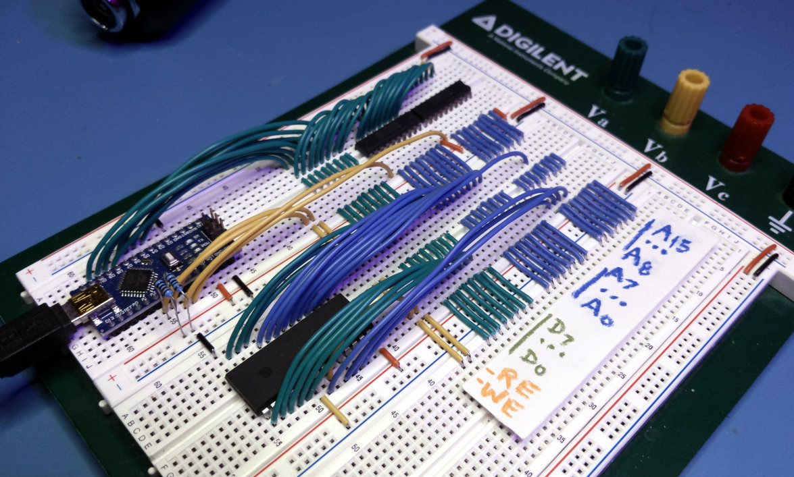
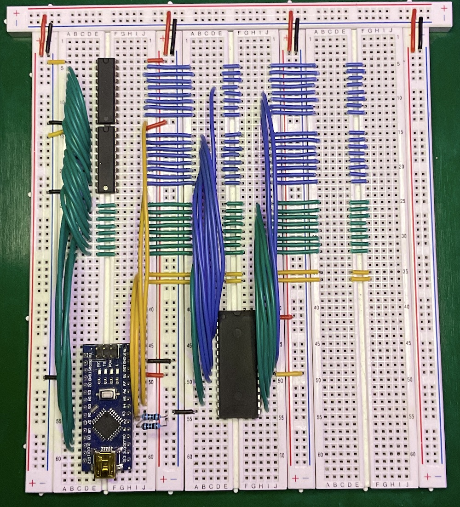
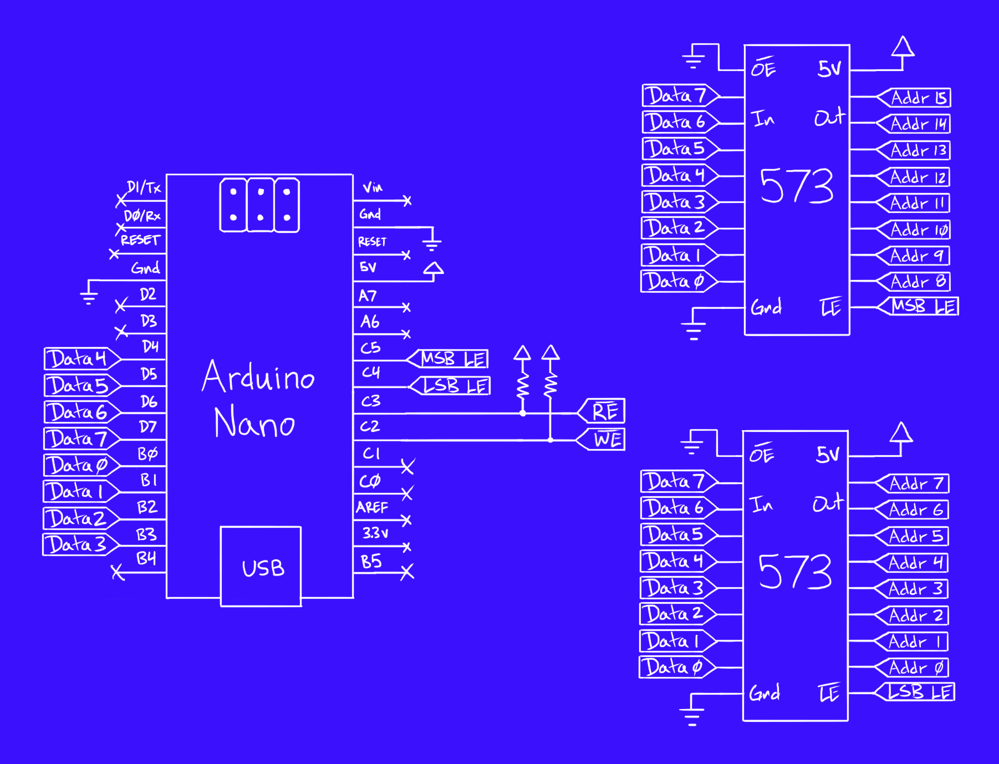

# Arduino EEPROM Programmer

- Build an EEPROM programmer with an Arduino, two 74HC573 latches, and a 28C EEPROM
- Command line tools for uploading IHX files built into firmware

Check out the video tutorial on YouTube [HERE](https://www.youtube.com/watch?v=L5m1qhdjgNw)



## Assembling the circuit





## Building the software

Use the [PlatformIO](https://platformio.org/) plugin for [VSCode](https://code.visualstudio.com/).

Open the project folder with VSCode, select the environment for your board (`uno`, `nano`, `oldnano`), and click `Upload`.


The [core](https://github.com/trevor-makes/core) library is required and PlatformIO will download this into the `.pio` folder.

Distributed under the [MIT license](LICENSE.txt)

## Using the programmer

After building and uploading the program to the Arduino, connect a serial monitor such as the one included with PlatformIO. A `>` should appear as a prompt for input. The following commands are available:

For all commands, integer parameters maybe be specified in decimal `255`, hex `$FF`, octal `&377`, or binary `%11111111`.

```
>baud [rate]
```

The baud rate defaults to 9600, but can be changed at runtime. Type `ctrl-t` `b` `[rate]` in the PlatformIO terminal to match the changed baud rate. Setting the baud rate too high can cause IHX import to fail if it exceeds the EEPROM page write timing. Tested with 115200 and found to be within a safe margin.

### Burning data in IHX format

Data to be written to EEPROM must be converted to plain text [Intel HEX](https://en.wikipedia.org/wiki/Intel_HEX) format. Use the [bin2ihx](scripts/bin2ihx.py) script to convert from a binary file or the [ihx2bin](scripts/ihx2bin.py) script to do the reverse.

The plain text data may be copy/pasted into the host terminal or uploaded with a special terminal command. The PlatformIO terminal supports uploading with the `ctrl-t` `ctrl-u` [escape sequence](https://docs.platformio.org/en/latest/core/userguide/device/cmd_monitor.html#examples).

```
>import
```

All input following the command will be parsed as Intel HEX and written to the EEPROM in paged write mode.

```
>verify
```

All input following the command will be parsed as Intel HEX and validated against values read from the EEPROM. Prints "PASS" on success. Prints "FAIL" and marks differences with '*' otherwise.

```
>export [base] [size]
```

Prints EEPROM data from `base` to `base + size - 1` in Intel HEX format.

### Special EEPROM commands

Tested with Atmel AT28Cxx EEPROMs

```
>erase
```

Erases all EEPROM data to hex FF.

```
>unlock
```

Disables software data protection.

```
>lock
```

Enables software data protection. Attempts to write data will be discarded until the `unlock` command is issued.

### Low level read/write operations

```
>hex [base] [size]
```

Prints a hex dump of ROM data from `base` to `base + size - 1`.

```
>set [base] "string pattern"
```

Writes ASCII data to EEPROM starting at `base`. No null terminator is written.

```
>set [base] $41 255 %01000001 'A' "strings too"
```

Writes byte or ASCII data sequentially to EEPROM starting at `base`.

```
>fill [base] [size] [pattern]
```

Repeats one-byte `pattern` in EEPROM from `base` to `base + size - 1`.

```
>move [source] [size] [dest]
```

Copies EEPROM from [`source`...`source + size - 1`] to [`dest`...`dest + size - 1`]. Destination may overlap with source.
